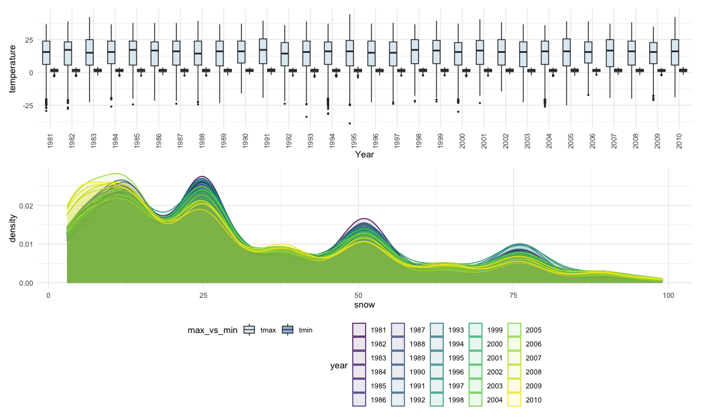

Homework 3
================
Yue Liu

## Problem 1

This dataset contains 1384617 rows and 15 columns.

Observatiions are the level of items in orders by user. There are user /
order vairiables – user ID, order ID, order day, and order hour. There
are also item variables – name, aisle, department, and some numeric
codes.

How many aisles, and which are most items from?

``` r
instacart %>% 
  count(aisle) %>% 
  arrange(desc(n))
```

    ## # A tibble: 134 x 2
    ##    aisle                              n
    ##    <chr>                          <int>
    ##  1 fresh vegetables              150609
    ##  2 fresh fruits                  150473
    ##  3 packaged vegetables fruits     78493
    ##  4 yogurt                         55240
    ##  5 packaged cheese                41699
    ##  6 water seltzer sparkling water  36617
    ##  7 milk                           32644
    ##  8 chips pretzels                 31269
    ##  9 soy lactosefree                26240
    ## 10 bread                          23635
    ## # … with 124 more rows

There are 134 aisles, and fresh vegetables are where the most items
from.

Make a plot.

``` r
instacart %>% 
  count(aisle) %>% 
  filter(n > 10000) %>% 
  mutate(
    aisle = factor(aisle),
    aisle = fct_reorder(aisle, n)
  ) %>% 
  ggplot(aes(x = aisle, y = n)) +
  geom_point() + 
  theme(axis.text.x = element_text(angle = 90, vjust = 0.5, hjust = 1))
```


Make a table.

``` r
instacart %>% 
  filter(aisle %in% c("baking ingredients", "dog food care", "packaged vegetables fruits")) %>% 
  group_by(aisle) %>% 
  count(product_name) %>% 
  mutate(rank = min_rank(desc(n))) %>% 
  filter(rank < 4) %>% 
  arrange(aisle, rank) %>% 
  knitr::kable()
```

| aisle                      | product\_name                                 |    n | rank |
| :------------------------- | :-------------------------------------------- | ---: | ---: |
| baking ingredients         | Light Brown Sugar                             |  499 |    1 |
| baking ingredients         | Pure Baking Soda                              |  387 |    2 |
| baking ingredients         | Cane Sugar                                    |  336 |    3 |
| dog food care              | Snack Sticks Chicken & Rice Recipe Dog Treats |   30 |    1 |
| dog food care              | Organix Chicken & Brown Rice Recipe           |   28 |    2 |
| dog food care              | Small Dog Biscuits                            |   26 |    3 |
| packaged vegetables fruits | Organic Baby Spinach                          | 9784 |    1 |
| packaged vegetables fruits | Organic Raspberries                           | 5546 |    2 |
| packaged vegetables fruits | Organic Blueberries                           | 4966 |    3 |

Apples vs ice cream

``` r
instacart %>% 
  filter(product_name %in% c("Pink Lady Apples", "Coffee Ice Cream")) %>% 
  group_by(product_name, order_dow) %>% 
  summarize(mean_hour = mean(order_hour_of_day)) %>% 
  pivot_wider(
    names_from = order_dow,
    values_from = mean_hour
  )
```

    ## `summarise()` regrouping output by 'product_name' (override with `.groups` argument)

    ## # A tibble: 2 x 8
    ## # Groups:   product_name [2]
    ##   product_name       `0`   `1`   `2`   `3`   `4`   `5`   `6`
    ##   <chr>            <dbl> <dbl> <dbl> <dbl> <dbl> <dbl> <dbl>
    ## 1 Coffee Ice Cream  13.8  14.3  15.4  15.3  15.2  12.3  13.8
    ## 2 Pink Lady Apples  13.4  11.4  11.7  14.2  11.6  12.8  11.9

## Problem 2

``` r
accel_df = read_csv("./data/accel_data.csv") %>% 
  janitor::clean_names() 
```

    ## Parsed with column specification:
    ## cols(
    ##   .default = col_double(),
    ##   day = col_character()
    ## )

    ## See spec(...) for full column specifications.

``` r
accel_df_tidy =
  accel_df %>% 
  pivot_longer(
    activity_1:activity_1440,
    names_to = "minute",
    names_prefix = "activity_",
    values_to = "activity_counts"
  ) %>% 
  mutate(minute = as.numeric(minute)) %>% 
  mutate(
    weekday_vs_weekend = recode(day,"Monday" = "weekday", "Tuesday" = "weekday", "Wednesday" = "weekday","Thursday" = "weekday", "Friday" = "weekday", "Saturday" = "weekend", "Sunday" = "weekend")) %>% 
    mutate(
    week = as.character(week) %>%
           forcats::fct_relevel(as.character(1:5)),
    day = factor(day),
    day = forcats::fct_relevel(day, c("Monday","Tuesday","Wednesday","Thursday","Friday","Saturday","Sunday"))
  ) %>% 
  group_by(week) %>% 
  arrange(day) %>% 
  relocate(week,  weekday_vs_weekend, day, minute, activity_counts)
```

The resulting 6 x 50400 dataset contains six variables: week,
weekday\_vs\_weekend, day, minute, activity\_counts, day\_id, and 50400
observations. The variables activity.\* from the raw dataset are
combined into two new columns, minute and activity\_counts. The row
order is changed to follow a chronological order instead of the day\_id
order. The column order is also changed since I feel for me that it is
easier to check the week and day first than to look for the day\_id.

``` r
accel_df_tidy %>%
    mutate(
    day = factor(day),
    day = forcats::fct_relevel(day, c("Monday","Tuesday","Wednesday","Thursday","Friday","Saturday","Sunday"))
  ) %>% 
  group_by(week, day) %>% 
  summarize(total_activity = sum(activity_counts)) %>% 
  pivot_wider(
    names_from = week,
    values_from = total_activity) %>% 
  knitr::kable()
```

    ## `summarise()` regrouping output by 'week' (override with `.groups` argument)

| day       |         1 |      2 |      3 |      4 |      5 |
| :-------- | --------: | -----: | -----: | -----: | -----: |
| Monday    |  78828.07 | 295431 | 685910 | 409450 | 389080 |
| Tuesday   | 307094.24 | 423245 | 381507 | 319568 | 367824 |
| Wednesday | 340115.01 | 440962 | 468869 | 434460 | 445366 |
| Thursday  | 355923.64 | 474048 | 371230 | 340291 | 549658 |
| Friday    | 480542.62 | 568839 | 467420 | 154049 | 620860 |
| Saturday  | 376254.00 | 607175 | 382928 |   1440 |   1440 |
| Sunday    | 631105.00 | 422018 | 467052 | 260617 | 138421 |

From the table, we see that activity counts are extremely low on the
Saturdays of week 4 and week 5. The Monday of week 1 also has a
relatively low activity counts.

``` r
accel_df_tidy %>%
  group_by(week, day) %>% 
  mutate(count = 1,
    hour = cumsum(count) %/% 60) %>% 
  group_by(week, day, hour) %>% 
  summarise(activity_hour = sum(activity_counts)) %>% 
  ggplot(aes(x = hour, y = activity_hour, color = day)) +
  geom_point() +
  geom_line(alpha = 0.5)
```

    ## `summarise()` regrouping output by 'week', 'day' (override with `.groups` argument)


From the graph we can see that the peaks of the activity counts are at
around 7am and 8pm. During 10am to 6pm activity counts stayed stable at
around 45000 per hour. Activities are relatively more frequent during
Tuesdays mornings, Sunday mornings, and Monday, Friday, Saturday
evenings.

## Problem 3

``` r
ny_noaa %>% 
  mutate(tmax = as.numeric(tmax)) %>% 
  mutate(tmin = as.numeric(tmax)) %>%
  summary()
```

    ##       id                 date                 prcp               snow       
    ##  Length:2595176     Min.   :1981-01-01   Min.   :    0.00   Min.   :  -13   
    ##  Class :character   1st Qu.:1988-11-29   1st Qu.:    0.00   1st Qu.:    0   
    ##  Mode  :character   Median :1997-01-21   Median :    0.00   Median :    0   
    ##                     Mean   :1997-01-01   Mean   :   29.82   Mean   :    5   
    ##                     3rd Qu.:2005-09-01   3rd Qu.:   23.00   3rd Qu.:    0   
    ##                     Max.   :2010-12-31   Max.   :22860.00   Max.   :10160   
    ##                                          NA's   :145838     NA's   :381221  
    ##       snwd             tmax              tmin        
    ##  Min.   :   0.0   Min.   :-389.0    Min.   :-389.0   
    ##  1st Qu.:   0.0   1st Qu.:  50.0    1st Qu.:  50.0   
    ##  Median :   0.0   Median : 150.0    Median : 150.0   
    ##  Mean   :  37.3   Mean   : 139.8    Mean   : 139.8   
    ##  3rd Qu.:   0.0   3rd Qu.: 233.0    3rd Qu.: 233.0   
    ##  Max.   :9195.0   Max.   : 600.0    Max.   : 600.0   
    ##  NA's   :591786   NA's   :1134358   NA's   :1134358

The ny\_noaa dataset contains information of all New York state weather
stations from January 1, 1981 through December 31, 2010. It has
information of weather station ID, date, precipitation, snowfall, snow
depth, maximum temperature, and minimum temperature. There are 7 columns
and 2595176 rows in the dataset. From the dataset, we see that out of
the total 2595176 recorded dates, 1134358 (43.71%) days do not have
information of both the maximum temperatures and minimum temperatures,
and 591786 (22.80%) days do not have information of snow depth. This
missing data might be an issue since it takes a significant portion the
dataset.

``` r
noaa_df = 
  ny_noaa %>% 
  separate(date, c("year","month","day"), "-") %>% 
  mutate(tmax = as.numeric(tmax)/10) %>% 
  mutate(tmin = as.numeric(tmax)/10) %>%
  mutate(prcp  = prcp/10) 

noaa_df %>% 
  drop_na(snow) %>% 
  count(snow) %>% 
  arrange(desc(n))
```

    ## # A tibble: 281 x 2
    ##     snow       n
    ##    <int>   <int>
    ##  1     0 2008508
    ##  2    25   31022
    ##  3    13   23095
    ##  4    51   18274
    ##  5    76   10173
    ##  6     8    9962
    ##  7     5    9748
    ##  8    38    9197
    ##  9     3    8790
    ## 10   102    6552
    ## # … with 271 more rows

After the data cleaning, the resulting 9 x 2595176 dataset contains 9
variables: id, year, month, day, prcp, snow, snwd, tmax, tmin. Date was
separated into year, month, and day. Units for maximum temperature and
minimum temperature are converted to degrees C. Precipitation units are
converted to mm.

For the variable snowfall, 0mm is the most commonly observed value,
indicating there is no snow for the most of the time.

``` r
jan_p = 
  noaa_df %>% 
  filter(month == c("01")) %>% 
  group_by(id, year, month) %>% 
  summarize(
    mean_tmax = mean(tmax, na.rm = TRUE)) %>% 
  drop_na() %>%
  ggplot(aes(x = year, y = mean_tmax, group = id)) +
  geom_point(alpha = 0.3) +
  geom_path(alpha = 0.3) +
  theme(axis.text.x = element_text(angle = 90, vjust = 0.5, hjust = 1)) +
  labs(title = "Average Max Temperatures in January and July from 1981-2010",
       y = "January")
```

    ## `summarise()` regrouping output by 'id', 'year' (override with `.groups` argument)

``` r
jul_p = 
  noaa_df %>% 
  filter(month == c("07")) %>% 
  group_by(id, year, month) %>% 
  summarize(
    mean_tmax = mean(tmax, na.rm = TRUE)) %>% 
  drop_na() %>%
  ggplot(aes(x = year, y = mean_tmax, group = id)) +
  geom_point(alpha = 0.3) +
  geom_path(alpha = 0.3) +
  theme(axis.text.x = element_text(angle = 90, vjust = 0.5, hjust = 1)) +
  labs(y = "July")
```

    ## `summarise()` regrouping output by 'id', 'year' (override with `.groups` argument)

``` r
jan_p /jul_p
```


The average max temperatures tend have a wave structure, as if the mean
max temperature is relatively high in one year, then the temperature
will drop in the following years and then back up again. January 1994
and January 2004 seem to have a relatively lower average max
temperatures than other years.

Outliers present in January 1982, January 2005, January 1999, January
2004, July 1984, July 1988, July 2004, and July 2007.

``` r
tmax_tmin_p =
  noaa_df %>% 
  na.omit() %>% 
  ggplot(aes(x = tmin, y = tmax)) +
  geom_smooth(se = FALSE)
```

``` r
tmax_tmin_p =
  noaa_df %>% 
  pivot_longer(
      tmax:tmin,
      names_to = "max_vs_min",
      values_to = "temperature"
    ) %>% 
  drop_na() %>% 
  ggplot(aes(x = as.factor(year), y = temperature, fill = max_vs_min)) +
  geom_boxplot(outlier.size = 0.5) +
  scale_x_discrete(breaks = seq(1981, 2010, 1), name = "Year") +
  theme(axis.text.x = element_text(angle = 90, vjust = 0.5, hjust = 1)) +
  scale_fill_brewer(palette="BuPu")

dist_snow_p = 
  noaa_df %>% 
  filter(snow > 0, snow < 100) %>% 
  #group_by(year)
  ggplot(aes(x = snow, fill = year, color = year)) +
  geom_density(alpha = .1)

(tmax_tmin_p / dist_snow_p) + plot_layout(guides = 'collect')
```



A boxplot is generated to compare the max temperatures and minumum
temperatures for each year. From the plot, we don’t see that many
changes in the average max temperatures or the average min
temperaturesthroughout the 30 years, however, the highest values for max
temperature seem to be higher in recent years than those values in the
past.

A density plot is generated to show the distribution of snowfall values
greater than 0 and less than 100 for each year. From the plot, we see
that the recent years tend to have smaller amount of snowfall than in
the 1980s.
